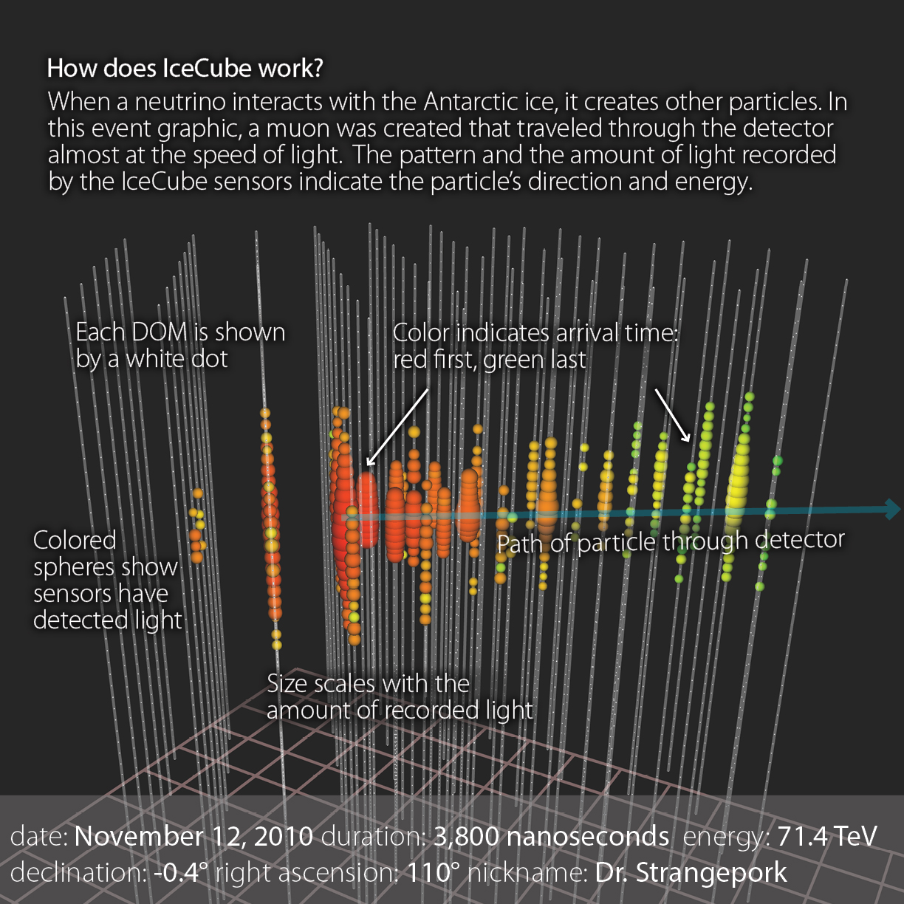

## ML-based Classification and Parameter Inference of Weakly Interacting Particle Events

This repository presents a physics-aware machine learning pipeline for analyzing
weakly interacting particle events using publicly released IceCube HESE
(High-Energy Starting Events) data. The project goes beyond standard event
classification by treating machine learning models as probabilistic inference
tools to study how detector-level parameters govern event topology and
uncertainty.

---

## Scientific Motivation

In neutrino telescopes such as the IceCube Neutrino Observatory, individual
particle interactions are not observed directly. Instead, reconstructed
detector-level observables (energy proxies, reconstruction likelihoods, and
topological signatures) are used to infer the underlying physical interaction.

This project investigates how machine learning can be integrated responsibly
into experimental astroparticle physics workflows — not as a black-box predictor,
but as a tool for classification, robustness analysis, and parameter inference.

---

## Dataset

- **IceCube HESE (High-Energy Starting Events) public data release**
- Real experimental neutrino events recorded at the South Pole
- Event-level reconstructed quantities

Each event includes:
- Reconstructed energy
- Reconstruction quality (`drlogl`)
- Event topology label (Track / Shower)

The data file is not included in this repository.  
Instructions for downloading the dataset are provided below.

---

## Methodology

### 1. Topology Classification
- Supervised classification of Track vs Shower events
- Models used:
  - Random Forest (nonlinear baseline)
  - Logistic Regression (interpretable baseline)
- Explicit handling of class imbalance
- Evaluation using cross-validation and physics-aware metrics

### 2. Robustness and Failure Analysis
- Identification of misclassified events
- Physical interpretation of failure modes
- Controlled noise injection into reconstruction-quality parameters
- Observation of graceful performance degradation

### 3. Probabilistic Parameter Inference
- Classifier outputs treated as probabilities rather than hard labels
- Inference of:
  - Mean P(Track | Energy)
  - P(Track | Energy, Reconstruction Quality)
- Smooth transitions observed in parameter space
- Statistical uncertainty estimated on inferred quantities

---

## Repository Contents

- `notebooks/01_topology_inference.ipynb`  
  Complete end-to-end analysis including classification, robustness testing,
  and probabilistic parameter inference.

- `results/`  
  Directory for generated figures and inference visualizations.

---

## Data Availability

The experimental data used in this project are publicly available from the
IceCube Collaboration:

https://dataverse.harvard.edu/dataset.xhtml?persistentId=doi%3A10.7910%2FDVN%2FPZNO2T&version=&q=&fileAccess=&fileTag=&fileSortField=&fileSortOrder=&tagPresort=true&folderPresort=true

