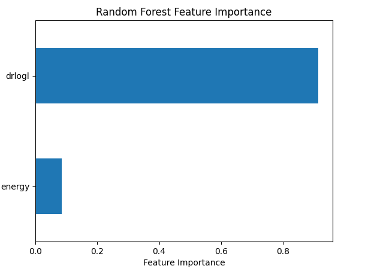
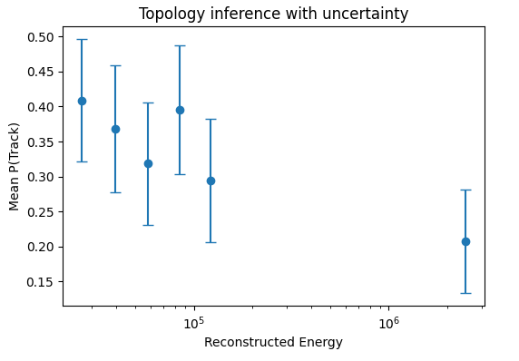
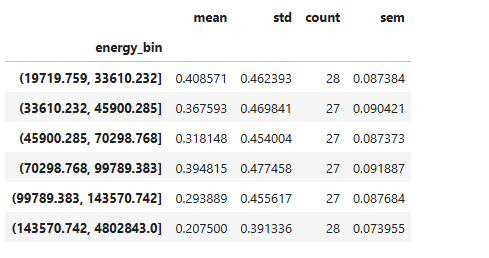
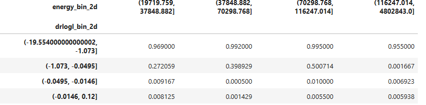

 ## Dataset Preview
 
 A snapshot of the IceCube HESE event-level dataset used in this analysis. Each row corresponds to a detected neutrino event, with reconstructed features including energy, directional parameters, reconstruction quality metrics, and topology labels (Track or Shower).

Key observation

The dataset represents real experimental data, not simulations. All machine learning models are therefore constrained by detector effects, reconstruction uncertainty, and intrinsic physical ambiguity.

---
## Selected features and labels
 
This figure highlights the core features used in the analysis
1. Reconstructed energy.
2. Reconstruction quality (drlogl).
3. Event topology label (Track / Shower).

**Interpretation**
1. These features are physically motivated:
2. Energy provides a proxy for the neutrino interaction scale.
3. drlogl quantifies reconstruction quality and event geometry.
4. Topology labels correspond to different interaction channels.
This choice ensures that the ML models learn from physically meaningful observables.

---
## Baseline classification performance
 
Logistic Regression achieves high but imperfect classification performance, with an overall accuracy of approximately 95%. Track events show slightly lower recall compared to Shower events.

**Interpretation**
The strong performance of a simple linear model indicates that topology separation is driven by genuine physical structure in the data rather than model complexity. Misclassified events correspond to ambiguous or poorly reconstructed interactions.

---
## Baseline classification performance
 
Feature importance analysis from the Random Forest classifier shows that reconstruction quality (drlogl) dominates topology separation, while reconstructed energy contributes a smaller but non-negligible role.

**Physical insight**
This demonstrates that event topology is primarily encoded in geometric and reconstruction-related information, consistent with expectations from Cherenkov light propagation and detector response.

---
## Probabilistic topology inference with uncertainty
 
The mean inferred probability of a Track-like topology is shown as a function of reconstructed energy, with error bars representing statistical uncertainty on the mean.

**Key observation**
A decreasing trend in Track probability is observed with increasing energy. This behavior is consistent with HESE event selection and the increasing dominance of shower-like interactions at higher energies.

**Why this is inference (not classification)**
Rather than assigning hard labels, the model output is interpreted probabilistically, enabling population-level parameter inference.

---
## Energy-binned inference statistics
 
This table summarizes the mean, standard deviation, sample count, and standard error of the inferred Track probability within each energy bin.

**Interpretation**
The statistical uncertainties confirm that the observed trend is robust across bins and not driven by a small number of events.

---
## Two-dimensional inference grid
 
The table shows mean inferred Track probability binned jointly in reconstructed energy and reconstruction quality (drlogl).

**Key insight**
High Track probability clusters at low drlogl (good reconstruction), while Shower-like events dominate regions of poorer reconstruction quality and higher energy. This reveals a smooth topology transition rather than a sharp boundary.

---
## 2D topology inference heatmap
 
A two-dimensional visualization of
P(Track | Energy, Reconstruction Quality).

**Physical interpretation:**
1. Track-like events dominate regions of good reconstruction quality
2. Shower-like events dominate at higher energies and poorer reconstruction
3. Transitional regions reflect intrinsic detector and physical ambiguity

**Why this result is important?**
This figure demonstrates that machine learning can be used as a probabilistic inference tool to map topology behavior across detector parameter space, rather than acting as a black-box classifier.

---
## Final Results Summary
**Key scientific outcomes-**
1. Machine learning models successfully distinguish IceCube event topologies using real detector data.
2. Reconstruction quality is the dominant driver of topology separation.
3. Energy modulates topology probability but is insufficient alone.
4. Probabilistic inference reveals smooth, physically interpretable transitions.
-Ambiguous events correspond to expected detector and reconstruction limitations
